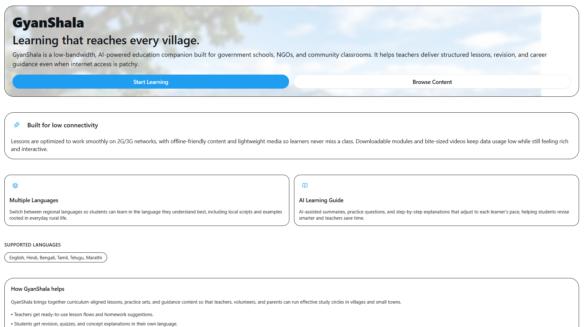
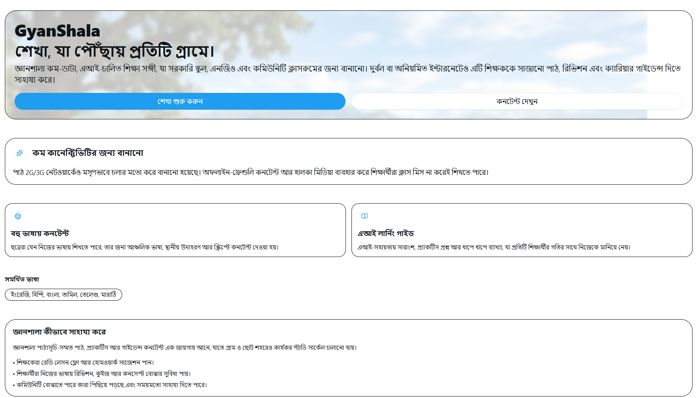
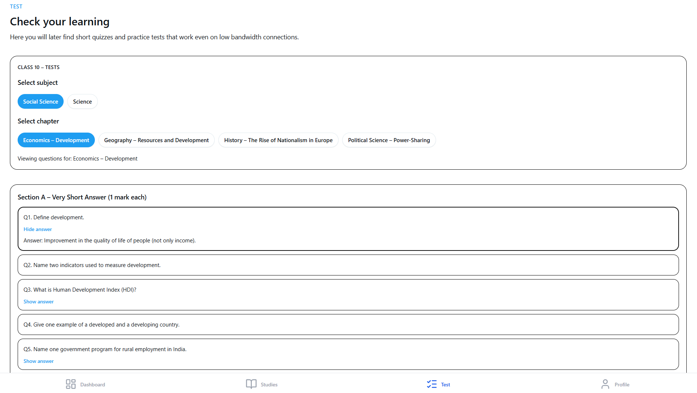
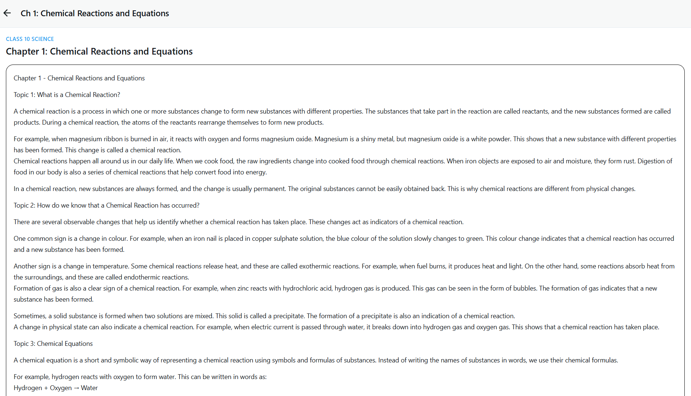
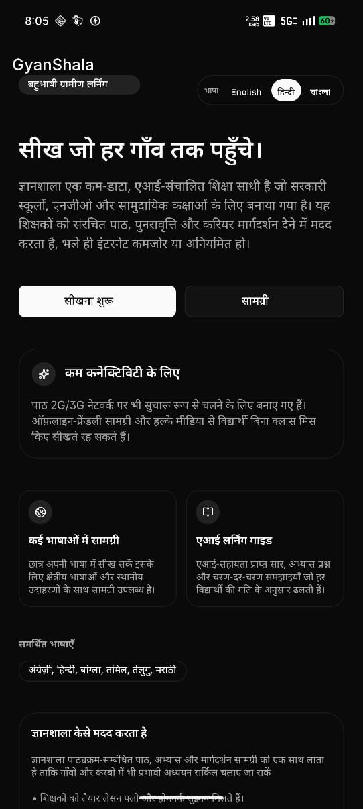
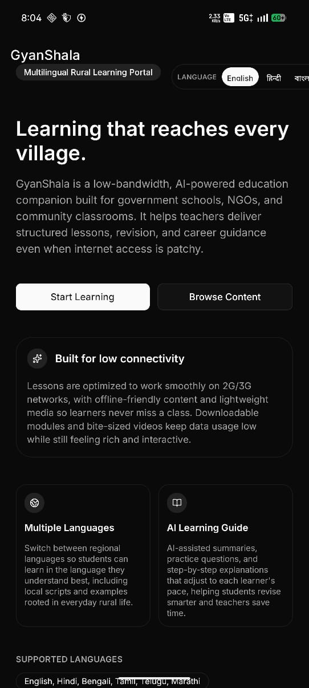
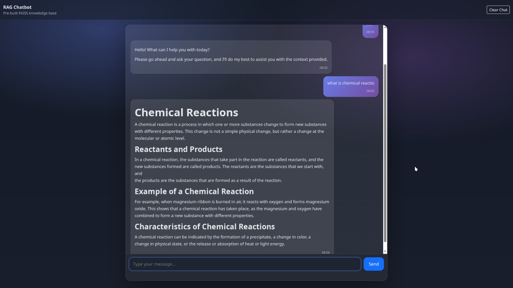
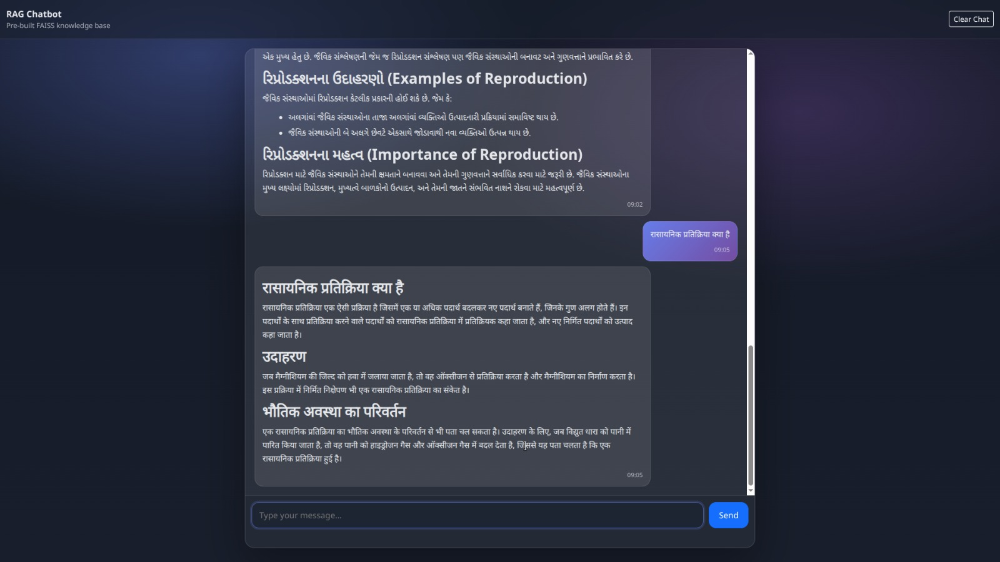
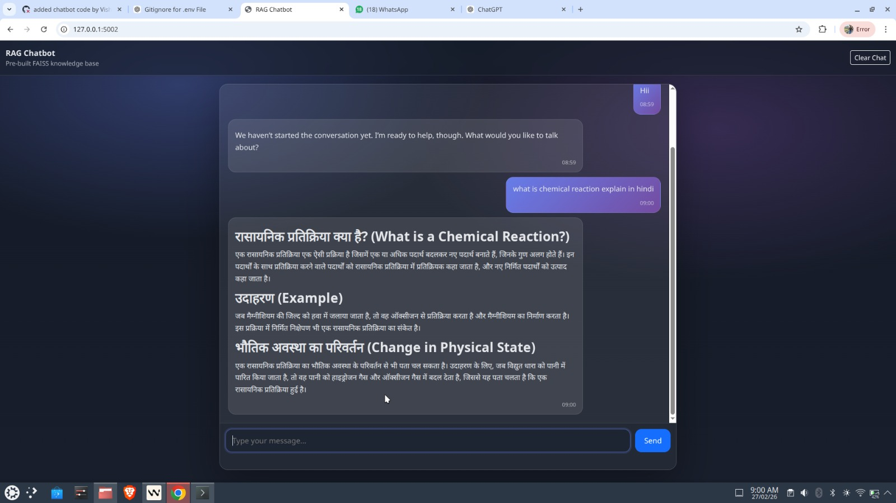

# Gyan-Shala  
### A Multilingual Digital Learning Platform for Rural Students  

**Hackathon:** Symbiosis Skill Hackathon (SSH-2026)  
**Team:** The BOSS (SSHE70)  
**College:** Devi Ahilya Vishwavidyalaya (DAVV), Indore  
**Theme:** EdTech  

**Prototype:** https://gyanshala-delta.vercel.app/

---

## Problem Statement

Rural students often lack structured and accessible guidance after Class 10 and 12. Career information is scattered, complex, and rarely available in regional languages or low-bandwidth formats. This results in poor academic decisions, missed scholarship opportunities, and limited awareness of government career pathways.

---

## Proposed Solution

**Gyan-Shala** is a multilingual web and mobile platform designed specifically for rural students. It provides:

- Subject-wise study content  
- Career guidance after 10th & 12th  
- Scholarship awareness  
- Government exam roadmaps  
- AI-powered academic support  

The platform prioritizes **regional languages and offline accessibility**, ensuring uninterrupted learning even in low-connectivity areas.

---

## Key Highlights

- **Regional Language First:** Learning content available in Hindi and regional languages.  
- **Offline & Low-Data Mode:** Downloadable resources optimized for rural internet conditions.  
- **Structured Career Roadmaps:** Clear step-by-step guidance for higher studies and competitive exams.  
- **AI Learning Assistant:** Simple doubt-solving and concept explanations using RAG-based chatbot.  
- **Practical & Student-Friendly Content:** Easy-to-understand notes and career insights.

---

## Technology Stack

### Frontend
- HTML  
- CSS  
- JavaScript  
- React (Web)  
- React Native (Mobile App)  
- React i18n (Multilingual Support)  
- Tailwind CSS  

### Backend & AI
- Python  
- Flask  
- LangChain (RAG Chatbot)  
- MySQL (Database)

---

## Architecture Overview

- Web & Mobile Frontend (React / React Native)  
- Backend API (Flask)  
- RAG-based AI Assistant (LangChain)  
- MySQL Database  
- Translation Layer (i18n)

---

## Target Audience

Rural school students across India, especially those in Class 10 and 12.

---

## Impact

- **Builds Confidence:** Students gain clarity in academics and career planning.  
- **Right Direction at the Right Time:** Structured guidance prevents wrong decisions.  
- **Equal Access:** Rural learners receive quality digital guidance.  
- **Financial Awareness:** Timely scholarship and exam updates reduce uncertainty.

---

## Implementation & Sustainability

### Technology Readiness
AI-based recommendations, smart doubt resolution, progress dashboards, and lightweight architecture ready for scalable deployment.

### Ground-Level Usability
Simple interface, multilingual support, mobile-first design, and guided navigation suitable for rural learners.

### Economic Sustainability
Built using open-source technologies with low infrastructure cost and scalable cloud deployment.

---

## Platform Snapshots

### Web Application View

The Gyan-Shala mobile application is designed specifically for rural students with a clean, simple, and multilingual interface. It supports:

- Subject-wise learning content
- Career guidance after 10th and 12th
- Scholarship information
- Low-data and offline access
- AI-powered academic support

The app is optimized for low-bandwidth environments and ensures smooth performance even in limited connectivity areas.
The web platform provides a structured learning environment accessible from any browser. It includes:

- Organized subject notes and summaries
- Structured career roadmaps
- Government exam guidance
- Scholarship awareness hub
- Regional language support

The website is lightweight, responsive, and accessible across devices to ensure equal access for rural students.

### Mobile App View

The Gyan-Shala mobile application is designed specifically for rural students with a clean, simple, and multilingual interface. It supports:

- Subject-wise learning content
- Career guidance after 10th and 12th
- Scholarship information
- Low-data and offline access
- AI-powered academic support

The app is optimized for low-bandwidth environments and ensures smooth performance even in limited connectivity areas.

### 🤖 QA Chatbot (AI Learning Assistant)

The AI-powered QA Chatbot is built using Retrieval-Augmented Generation (RAG) with LangChain and FAISS. It provides:

- Instant doubt resolution  
- Context-aware answers from study materials  
- Multilingual support (English, Hindi, Gujarati)  
- Simple explanations in student-friendly language  
- Real-time academic assistance  

The chatbot enhances understanding and promotes self-driven learning for rural students.

---

## 🚀 Vision

To bridge the rural education gap by delivering structured, multilingual, and offline-capable academic and career guidance — enabling self-driven learning and sustainable rural growth.
